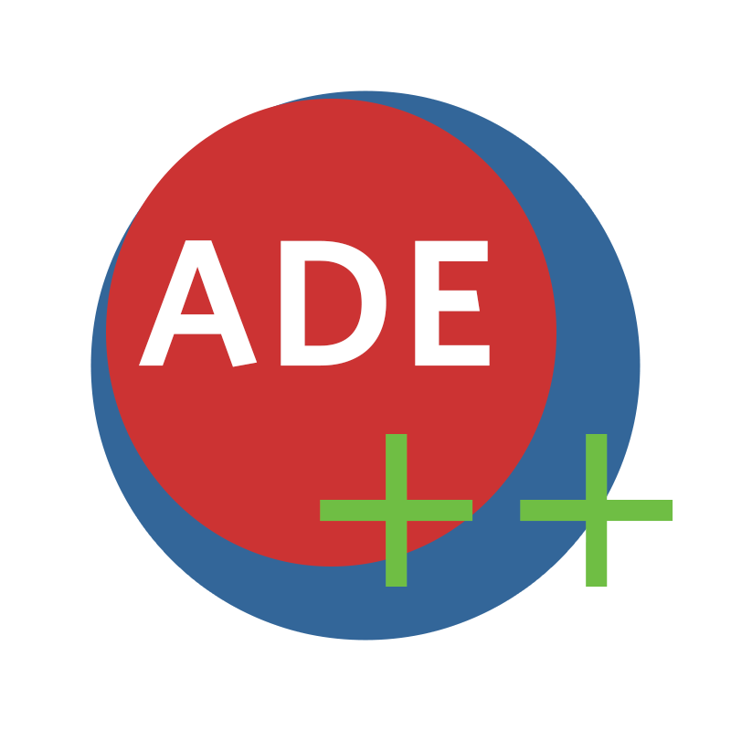

# PTemploiDuTemps

Voici ADE++, un logiciel de gestion de planning.

Pour modifier le code il faut avoir Visual Studio Community (2022 au mieux), Qt version 6 (Il faut aussi activer les extentions : QtNetwork qui permet la communication avec le protocole HTTP, QtMultimedia pour la gestion du son qui est optionnel) et Qt Visual Studio Tools et PHP Tools for Visual Studio.

L'API web est incluse et est programmée en PHP, elle permet l'accès à la base de données der manière sécurisée.

Une connexion internet est nécessaire. 

Programmé en C++ (Qt) et PHP avec Visual Studio.